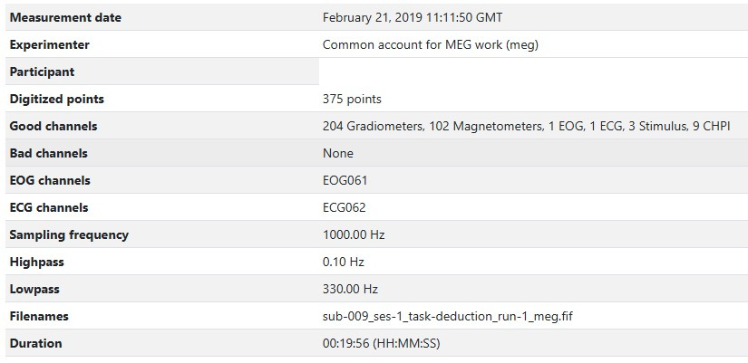
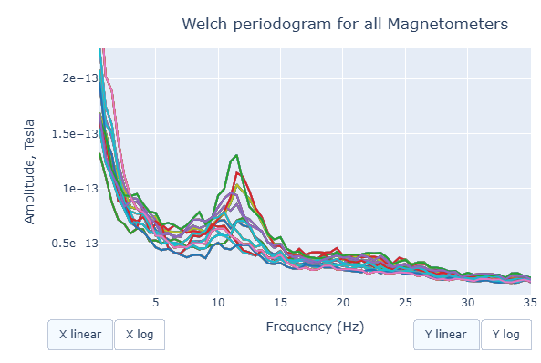
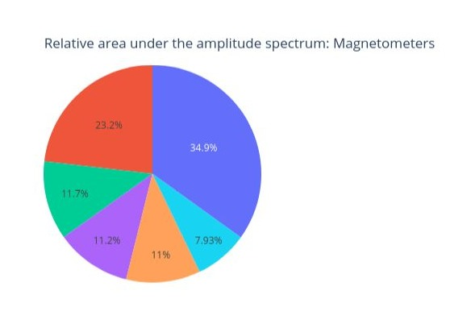

# MEGqc report overview

Every metric generates its own HTML report with interactive figures. In this section we'll overview these reports using data from one subject in the dataset _ds003483_, which Gaponsetva (2023) used to evaluate the MEGqc tool. 

All the figures in these reports are interactive: you can zoom in and out, reveal legends on hover, hide/show specific epochs or channels within a specific region just by clicking. Unfortunately, this interactive feature is lost in this tutorial, as we'll work with screenshots.

Since in this tutorial we'll work with the same dataset (subject-009 from the dataset _ds003483_), you'll be able to obtain these same reports yourself and explore the interactive features.

## Raw Information

The following information is not directly visible in this report, but it's important to understand. MEGqc extracts the data as an MNE Raw class object. The Raw object includes metadata such as  channels' details, distinguising among Gradiometers and Magnetometers (more on that later), EOG and ECG channels, sampling frequency, applied filters, and more.

## Sensor Positions

Almost every report starts with this visual representation of the spatial distribution of MEG sensors on the subject's head. The sensors are divided into eight color-coded groups representing different lobes. This same color coding will be used frequently throughout the reports. Each sensor dot in the plot has 3 different identifiers:
- 1 Magnetometer: it measures the magnetic field directly, providing data on its strength and direction. It is more sensitive to distant source, making it more vulnerable to external magnetic noise. Its label ends with '1', like 'MEG1011'.
- 2 Gradiometers: These sensors measure the gradient of the magentic field, so the difference between 2 measurements. This setup helps filter out environemntal noise. Their labels end with '2' and '3', such as 'MEG0112' and 'MEG0113'. 

The identifiers pop up on hovering oveer the sensor dot in the interactive HTML. 

Also, many reports include 2 sets of results: one for the Magnetometers and another set for the Gradiometers. This tutorial focuses on Magnetometers, but the Gradiometers set of results follow the same logic.

## Metrics

### Standard deviation of the data

The Standard Deviation (STD) metric measures the variability of each channel. If some channels show much higher or lower STD than others, it suggest potential malfunctions (Gapontseva, 2023).
Each dot represents the standard deviation of a Magnetometer channel over the entire time series. The sensors are colored according to the regions of the Sensor Distribution plot. Hovering over a dot reveals the standard deviation value. The position of the points on the Y axis are not meaningful, they are just for visualization purposes.     
Channels with values exceeding (or below) a certain amount of standard deviations from the average are flagged as noisy (or flat), indicating potential outliers.     

 

In the second figure, the data is divided into epochs. Each box plot corresponds to a channel or sensor, and each point represents the standard deviation for that sensor during an individual epoch. Epochs are created by segmenting the continuous MEG recording basend on triggers in the dataset. By hovering over any of the points, users can read the specific epoch represented. Sensors with points outside the whiskers indicate higher variability, potential artifacts, or irregularities in specific epochs. 

  

A horizontal bar at the bottom allows users to zoom in on a subset of sensors, enabling a closer examination of how the standard deviation changes within specific regions. In this case, 6 sensors of the Left Frontal area.

Each box plot represents a single epoch, and each dot the standard deviation value for every specific sensor during that epoch. The sensors are color coded.  
This type of figure is most relevant for experiments with relevant time events.  

Once again, we can use the horizontal bar at the bottom to zoom in on a subset of sensors. This visualization helps to visually detect in 5 periods where multiple sensors had an increased variability.  

We can make interpretations or especulate if outliers might be due to muscle activity, external noise or transient artifacts, but MEGqc only reports the anomalies.  

As it was mentioned before, all this set of figures gets repeated for Gradiometers.

### Power Spectrum Density

The Power Spectrum Density describes how the power of a signal is distributed across different frequencies. It provides information on the strength or intensity of different frequency components. PSD calculation helps us to distinguish between brain activity and non-brain-related noise (Gapontseva, 2023).  

  

This circle chart represents the Signal-to-Noise Ratio (SNR). A high SNR indicates minimal corruption of the signal of interest by background noise. The prominent amplitude of the 11.5 Hz frequency labels it as potential noise.

The Welch periodrogram is commonly used to estimate the power of a signal at different frequency components.  
The X-axis represents the frequency range of the signal (from 0 to 140 Hz in this case) and the Y-axis represents the amplitude of the signal. 
Each colored line represents the PSD for the different magnetometers. As it was previously reported, there's a visible peak at 11.5 Hz.

Interactive features in the HTML report allow toggling between linear a **linear** view or a **logarithmic** view of both the X-axis and the Y-axis independently. 

Each segment of this circle chart represents the proportion of the total signal power that falls within each frequency range. How much does every frequency band contribute to the overall signal. 

### Peak to Peak Amplitude
Peak-to-Peak (PtP) amplitude refers to the difference between the highest positive peak and the lowest negative peak. It provides a measue of the total range of variation of the data averaged over a time interval (Gapontseva, 2023). 

The PtP amplitude of the data over the entire time series represents how the PtP amplitude of every sensor varies over the entire time series. Every dot represent the PtP amplitude of a single sensor. If a sensor falls outside of the whiskers area, it might indicate that the sensor is malfunctioning or other issues.

The position in the Y Axis is not meaningful but serves visualization purposes.

In this plot, each box plot represents a specific sensor (color-coded by areas) and each point the PtP Amplitude for that sensor during a specific epoch (time window).  

In this plot, each box plot represents an epoch and each point the PtP Ampltiude of the sensors during that specific time window.  

### ECG: heart beat interference

Heartbeat interference is a common source of noise in MEG recordings. This intereference shows up as a rhythmic and periodic fluctuation, and it varies among participants (Gapontseva, 2023). 

First, we have a short overview with key criteria about the ECG signal recorded. MEGqc evaluates whther the heartbeats were recordnd in a consistently (similar amplitude), without missing beats (no breaks) and without false detections (no bursts). These aspects are relevant for determining if the channel issuitable heartbeat artifact identification. 

Here, we see the ECG signal (blue line) captured by the ECG channel (ECG062), with the red marking the R-peaks of each heartbeat. The R-peaks are components of the electrical activity of the heartbeat, and they can be easily used as reference points to identify heartbeat intereference.

The mean recorded R wave (from the ECG channel, real heartbeats) was shifted to align the _ECG signal found on MEG channels_. This alignment helps us understand the extend to which the hearbeats influence he MEG channels. Then, a Pearson correlation is performed between the _ECG signal found in each MEG channel_ and the reference mean signal of the ECG.

The following 3 plots highlights the MEG channels affected by heartbeat interference. Each line representes one MEG sensor, colour-coded by region. The plots are ordered from the most affected to the least affected. 

### EOG: eye movement interference

The EOG (Electrooculogram) sensor records eye activity and is used to detect eye movements, which are usually separated into saccades and blinks. The MNE algorithms, however, only identify blinks (Gapontseva, 2023).

This plot shows the EOG signal over time (blue line). Each blink produces a peak, marked by a red dot. An averaged eye-blink event is expected to have a wave-like shape with one main crest. If no such shape is detected in most of the data files in a set, the EOG channel is marked as "bad". 

This plot represents the mean event shape, which indicates the typical waveform of a blink as captured by the EOG channel. This allows us to understand how blinks influence MEG sensors. 

Similar to the ECG report, the following three plots show the MEG channels affected by blink artifacts, ranked from the most affected to the least affected. This help us to identify channels that may require artifact correction before analysis.

### High frequency (Muscle) artifacts
Muslce contractions generate electrical activity noticeable in the range of 110-140 Hz (as suggested by MNE). Examples include clenching the jaw, swallowing or twitching cranial muscles (Gapontseva, 2023).

This report includes a single plot displaying the z-scores of high frequency (blue line) and events (red-dots) where the z-score exceed the threshold of 5 (default in settings)

### Estimation of subjet's head movement
These movements may appear as sudden shifts or jumps in the MEG data, causing distortions in the spatial distribution of the recorded magnetic fields. The effects of head movements can vary depending on the strength and direction Gapontseva, 2023).
This module is implemented but requires a substantial amount of information to perform the calculation.